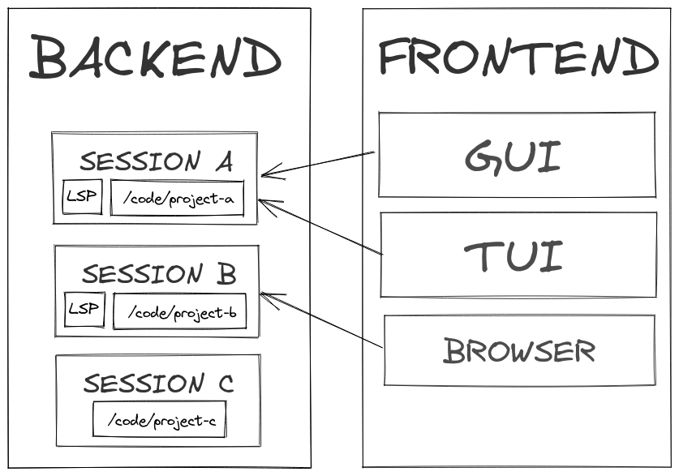

<h1 align="center">
  <a href="https://github.com/gbaranski/eb">eb - Editor Backend</a>
</h1>
<h4 align="center">Editor backend for code editors following the client server achitecture.</h4>

- [Architecture](#architecture)
- [Project status](#project-status)
- [Problem](#problem)
- [Q&A](#qa)
  - [Why can't you just SSH/Mosh to a remote server and launch Vim there?](#why-cant-you-just-sshmosh-to-a-remote-server-and-launch-vim-there)
  - [What's different from Kakoune server?](#whats-different-from-kakoune-server)
        - [Why not `xi-editor`?](#why-not-xi-editor)

# Architecture

# Project status

I'm trying to develop a working proof-of-concept.

# Problem

No separation of client/server in current editors.

Separating editors to client and a server has few advanteges: 

1. Server can be started on a beefy machine while running frontend on a small and slow laptop, without slowing down your development experience or consuming battery.
2. Easy collaborative programming.
3. Easier to create a new frontend, no need for handling LSP Server yourself. Some could say "Why would you want to implement a new fronted? We already have X."
  - Imagine you want a native MacOS editor made with Cocoa, or a editor made in GTK, there are not that many of those, and they might not support advanced features such as LSP.
  - I'm a Vim user myself, and I don't imagine coding in a editor which doesn't support Vim keybindings, some editors such as VSCode have plugins for that, however from my experience they make the editor horribly slow. 
4. Long-running sessions. You can run the server in background, while having editor closed, that'd greatly improve it's startup time. 

# Q&A

## Why can't you just SSH/Mosh to a remote server and launch Vim there?

I've been doing this for a long time, this works, but it has few cons:
- Quite high input latency.
- If we use Mosh, we don't have true color support, it is theoritically supported, but only on `master` branch which isn't available if we want to use it on Termux.
- No native feeling, maybe that's not a big issue when you connect from a laptop or a PC, but it's an issue if you connect from mobile phone. `eb` will allow making Android/iOS app which will connect to editor server.

## What's different from Kakoune server?

While Kakoune makes server which is used only by the kakoune frontend, I want to make a standard editor backend that can be used by many editors such as VSCode. Similarly how Microsoft came up with LSP, which is used by most of the editors right now.  

##### Why not `xi-editor`?

`xi-editor` is dead, but I'd like to take some inspiration from it's design.
